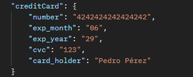

# prueba tecnica - Frontend

## resumen del funcionamiento
1. ingresas al dashboard, te mostrara todos los productos en stock
2. puedes seleccionar la cantidad del producto y dale en comprar
3. al hacer la compra te pedira que inicies seccion, si no tienes cuenta puedes crear una **/signin**
4. despues de estar autenticado, te redireccionara a un modal para que ingrese tu tarjeta de credito
  

5. te mostrara el checkout con tu producto, en el cual puedes varias la cantidad del mismo y ver los costos de envio y impuestos
6. al pagar te mostrar el detalle de la transaccion y se desconara la cantidad del item